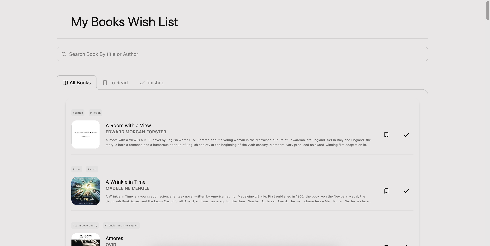

_Screenshot of the main interface showing book cards and tab switching._

# Books Wish List

A clean and interactive book wishlist web app built with HTML, CSS, JavaScript, and Alpine.js.  
Users can browse a list of books, switch between reading states, and mark favorites.

## Features

### 🔍 UI Features

- Browse books with cover, author, and subject tags
- View full description in detail panel
- Tab switching: All / To Read / Finished
- Mark books as Favorite
- Toggle reading status with interactive icons
- Responsive and smooth DOM rendering (Alpine.js)

### 🧠 Logic & Data Flow

- Search books by title or author
- Dynamic status update with local mock API (JSON Server)
- Combined data from two external APIs
- Manual normalization and key-matching logic for description data

## Tech Stack

- HTML / CSS / JavaScript
- Tailwind CSS / DaisyUI
- Phosphor Icons (inline SVG)
  - Icons are from Phosphor Icons, embedded via inline SVG for easier customization with Tailwind utility classes.DaisyUI's built-in icons were not used to better match the desired visual style and control.
- Alpine.js
- JSON Server
- Git & GitHub

## Getting Started

- Run `npm install` to install all packages.
- Run `npm run all` to launch:
  - Vite development server (default: port `5173`)
  - JSON Server (default: port `3002`) - `/allBooksData` - `/toReadBooksData` - `/finishedBooksData` - `/favoriteBooksData`
    > `npm run all` will launch both Vite and JSON Server concurrently.  
    > Make sure you have `concurrently` installed (already included in `package.json`).

## Development Tools

- Vite for development server

## API Sources

- This project uses two public APIs:
  - Book data (title, author, subject, cover): Open Library API (https://openlibrary.org/developers/api)
  - Book description (text summary): Wikipedia REST API (https://www.mediawiki.org/wiki/API:REST_API)

> Data is normalized and combined manually due to differences in structure.
> Descriptions are fetched by matching book titles to Wikipedia entries.

## About This Project

This project was built as a practice to deepen understanding of:

- JavaScript logic structuring and modularization
- State control using Alpine.js
- API integration and data normalization
- DOM manipulation and UI synchronization

It is not meant to be production-ready, but focuses on learning key frontend skills.
